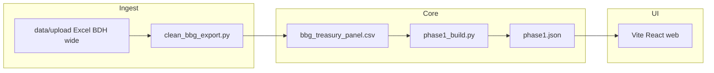

# Architecture

**Last Updated:** 2026-03-23

Treasury dashboard: ingest Bloomberg BDH exports, clean to a daily panel, run per-factor signals and backtests against **USGG10YR**, serve results in a static React app.

## System Overview



## Domain Map

| Domain | Code | Spec |
| :--- | :--- | :--- |
| Data pipeline | `scripts/clean_bbg_export.py`, `data/processed/` | `specs/data-pipeline.md` |
| Signals & backtest | `scripts/phase1_build.py`, `web/public/data/phase1.json` | `specs/signals-backtest.md` |
| Web dashboard | `web/src/`, `web/public/` | `specs/web-dashboard.md` |

## Directory Structure

```
Treasury dashboard/
├── scripts/                 # Python: clean panel, phase1 JSON
├── data/
│   ├── upload/              # Raw Bloomberg Excel (gitignored optional)
│   └── processed/           # bbg_treasury_panel.csv, meta JSON
├── web/                     # Vite + React + Tailwind
│   ├── src/
│   ├── public/data/         # phase1.json (generated)
│   └── dist/                # production build (gitignored)
├── references/              # BDH paste TSV
├── tests/                   # pytest (e.g. phase1 signal timing)
├── docs/
│   └── user-guide.md        # Operator workflow (Bloomberg → dashboard)
├── specs/
├── .agents/workflows/
├── .cursor/rules/
├── .cursor/skills/          # e.g. chart-timeline (time-axis chart convention)
├── AGENTS.md
└── TODO.md
```

## Tech Stack

| Layer | Technology |
| :--- | :--- |
| Data | Python 3, pandas |
| UI | TypeScript, React 19, Vite 6, Tailwind CSS 4 |
| Source data | Bloomberg Excel BDH (user-provided) |

## Conventions

- **Python:** type hints where helpful; scripts runnable from repo root.
- **TS/React:** functional components; fetch dashboard data from `public/data/phase1.json`; equity chart uses real dates on the x-axis (see `.cursor/skills/chart-timeline/`).
- **Paths:** prefer absolute paths in user docs as full strings; code uses `ROOT` relative paths in scripts.

## Security & Secrets

- No API keys in repo; Bloomberg runs on user machine.
- Do not commit customer export files if policy requires; `data/upload/` may stay local.
